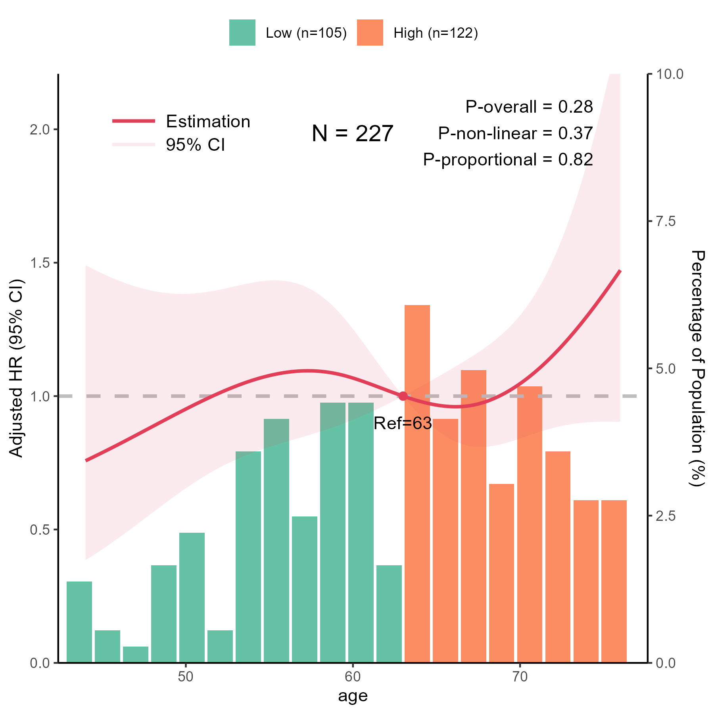
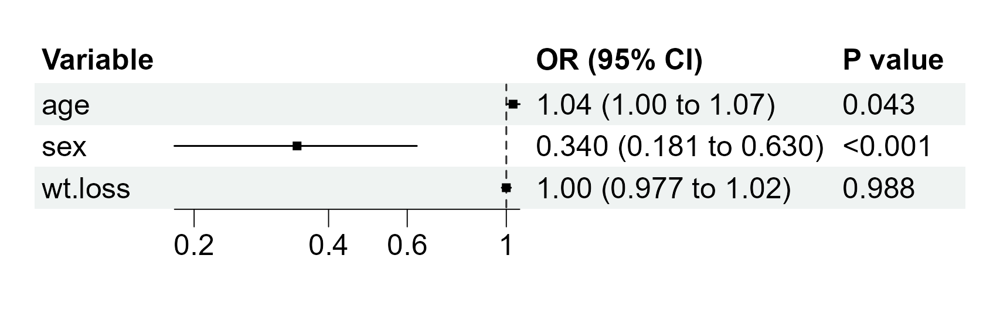
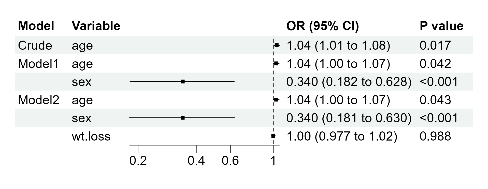
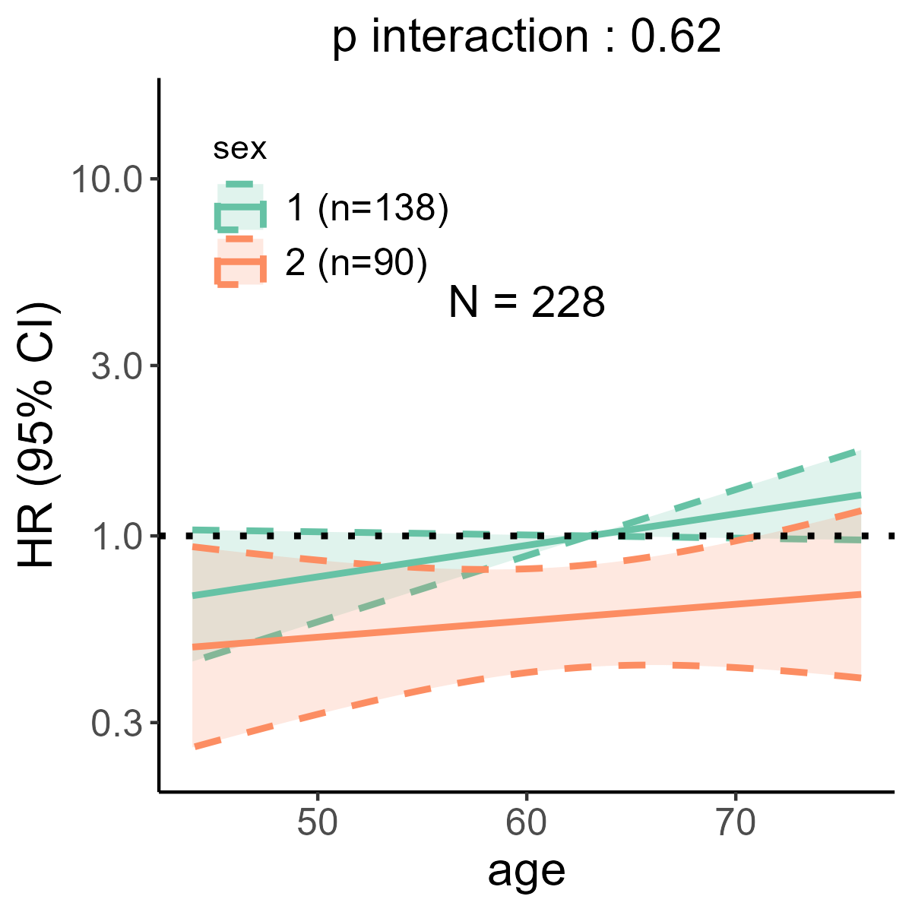
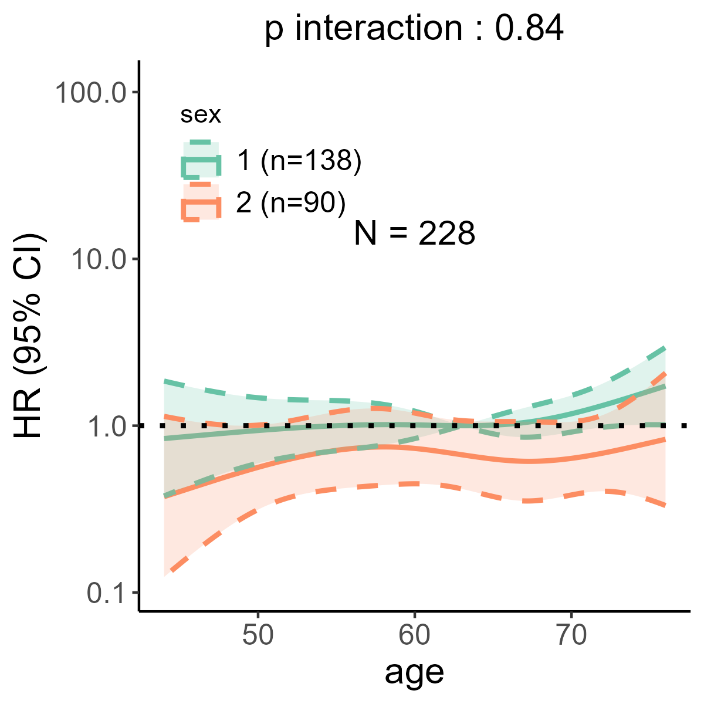

# clinpubr: Clinical Publication with R

## Overview
`clinpubr` is an R package designed to streamline the workflow from clinical data processing to publication-ready outputs. It provides tools for clinical data cleaning, significant result screening, and generating tables/figures suitable for medical journals.

## Key Features
- **Clinical Data Cleaning**: Functions to handle missing values, standardize units, convert dates, and clean numerical/categorical variables.
- **Significant Result Screening**: Tools for interaction analysis, model comparison, and regression result with common variable transformations to identify key findings.
- **Publication-Ready Outputs**: Generate baseline characteristic tables, forest plots, RCS curves, and other visualizations formatted for medical publications.

## Installation
Install the development version from GitHub:

```r
# Install devtools if needed
if (!requireNamespace("devtools", quietly = TRUE)) {
  install.packages("devtools")
}

devtools::install_github("yotasama/clinpubr")
```

## Basic Usage
### Example 1: Clean Numerical Data
```r
library(clinpubr)

# Sample messy data
messy_data <- data.frame(values = c("１２．３", "0..45", "  67 ", "", "ａｂａｎｄｏｎ"))
clean_data <- num_simple_cleaning(messy_data$values)
print(clean_data)

# "12.3"    "0.45"     "67"      NA        "abandon"
```

### Example 2: Automatic Type Infer and Baseline Table Generation
```r
# Using example data `mtcars`
var_types <- get_var_types(mtcars, strata = "vs") # Automatically infer variable types
baseline_table(mtcars, var_types = var_types, contDigits = 1, filename = "baseline.csv")
```
#### The generated table: baseline.csv
|                    |Overall        |vs: 0          |vs: 1          |p      |test    |
|:-------------------|:--------------|:--------------|:--------------|:------|:-------|
|n                   |32             |18             |14             |       |        |
|mpg (mean (SD))     |20.1 (6.0)     |16.6 (3.9)     |24.6 (5.4)     |<0.001 |        |
|cyl (%)             |               |               |               |<0.001 |exact   |
|4                   |11 (34.4)      |1 (5.6)        |10 (71.4)      |       |        |
|6                   |7 (21.9)       |3 (16.7)       |4 (28.6)       |       |        |
|8                   |14 (43.8)      |14 (77.8)      |0 (0.0)        |       |        |
|disp (mean (SD))    |230.7 (123.9)  |307.1 (106.8)  |132.5 (56.9)   |<0.001 |        |
|hp (mean (SD))      |146.7 (68.6)   |189.7 (60.3)   |91.4 (24.4)    |<0.001 |        |
|drat (median [IQR]) |3.7 [3.1, 3.9] |3.2 [3.1, 3.7] |3.9 [3.7, 4.1] |0.013  |nonnorm |
|wt (mean (SD))      |3.2 (1.0)      |3.7 (0.9)      |2.6 (0.7)      |0.001  |        |
|qsec (mean (SD))    |17.8 (1.8)     |16.7 (1.1)     |19.3 (1.4)     |<0.001 |        |
|am = 1 (%)          |13 (40.6)      |6 (33.3)       |7 (50.0)       |0.556  |        |
|gear (%)            |               |               |               |0.001  |exact   |
|3                   |15 (46.9)      |12 (66.7)      |3 (21.4)       |       |        |
|4                   |12 (37.5)      |2 (11.1)       |10 (71.4)      |       |        |
|5                   |5 (15.6)       |4 (22.2)       |1 (7.1)        |       |        |
|carb (median [IQR]) |2.0 [2.0, 4.0] |4.0 [2.2, 4.0] |1.5 [1.0, 2.0] |<0.001 |nonnorm |


### Example 3: Publish-ready Figure Generation
#### Example 3.1: RCS Plot
```r
# Using example data `cancer` from the `survival` package
data(cancer, package = "survival")

# Performing cox regression, which is inferred by `y` and `time`
rcs_plot(cancer, x = "age", y = "status", time = "time", covars = c("sex", "ph.karno"), save_plot = TRUE)
```
The generated figure: cox_rcs_status_with_age_4_knots_with_2_covars.png


#### Example 3.2: Regression Forest Plot
```r
data(cancer, package = "survival")
cancer$dead <- cancer$status == 2 # Preparing a binary variable for logistic regression

# Performing multivairate logistic regression
regression_forest(cancer, model_vars = c("age", "sex", "wt.loss"), y = "dead",
  as_univariate = FALSE, save_plot = TRUE
)

# Comparing multiple models
regression_forest(
  cancer,
  model_vars = list(
    Crude = c("age"),
    Model1 = c("age", "sex"),
    Model2 = c("age", "sex", "wt.loss")
  ),
  y = "dead",
  save_plot = TRUE
)
```
The generated figure: logistic_regression_forest_with_1_models.png


The generated figure: logistic_regression_forest_with_3_models.png



#### Example 3.3: Interaction Plot
```r
data(cancer, package = "survival")

# Generating interaction plot of both linear and RCS models
interaction_plot(cancer,
  y = "status", time = "time", predictor = "age",
  group_var = "sex", save_plot = TRUE
)
```
The generated figure: lin_cox_interaction_status_with_age_by_sex_with_0_covars.png


The generated figure: rcs_cox_interaction_status_with_age_by_sex_with_0_covars.png


## Documentation
For detailed usage, refer to the package vignettes (coming soon) or the [GitHub repository](https://github.com/yotasama/clinpubr).

## Contributing
Bug reports and feature requests are welcome via the [issue tracker](https://github.com/yotasama/clinpubr/issues).

## License
`clinpubr` is licensed under GPL (>= 3).