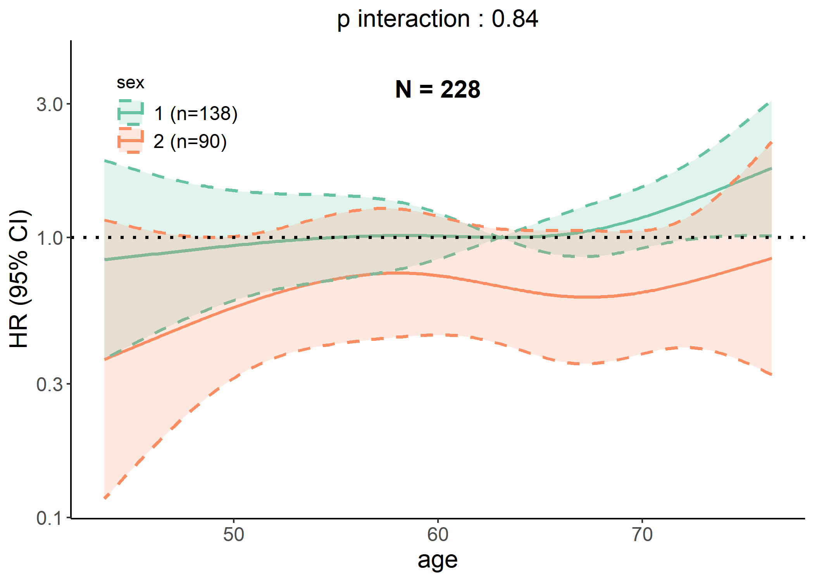
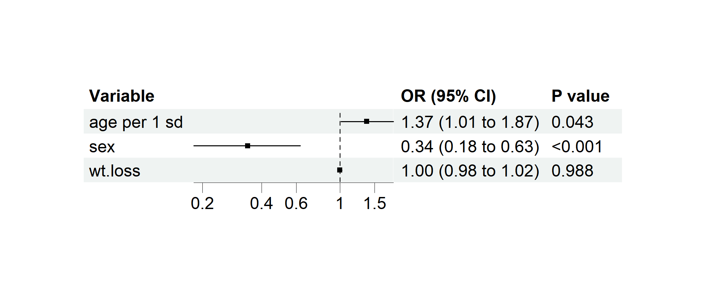
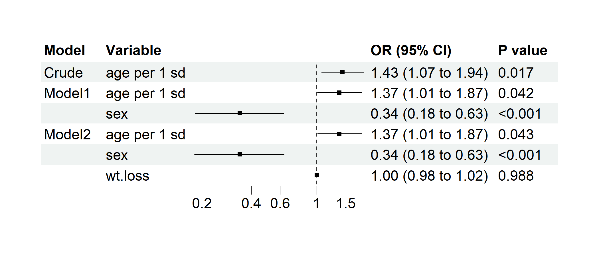
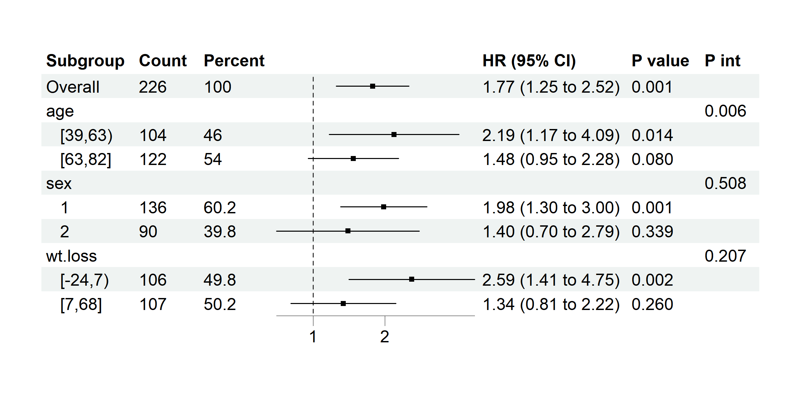

<!-- README.md is generated from README.Rmd. Please edit that file -->

# clinpubr: Clinical Publication with R

<!-- badges: start -->

[](https://CRAN.R-project.org/package=clinpubr)
[](https://app.codecov.io/gh/yotasama/clinpubr)
[](https://github.com/yotasama/clinpubr/actions/workflows/R-CMD-check.yaml)
<!-- badges: end -->

## Overview

`clinpubr` is an R package designed to streamline the workflow from
clinical data processing to publication-ready outputs. It provides tools
for clinical data cleaning, significant result screening, and generating
tables/figures suitable for medical journals.

## Key Features

- **Clinical Data Cleaning**: Functions to handle missing values,
  standardize units, convert dates, and clean numerical/categorical
  variables.  
- **Significant Result Screening**: Tools for interaction analysis,
  model comparison, and regression result with common variable
  transformations to identify key findings.  
- **Publication-Ready Outputs**: Generate baseline characteristic
  tables, forest plots, RCS curves, and other visualizations formatted
  for medical publications.

## Installation

You can install the development version of clinpubr from
[GitHub](https://github.com/) with:

``` r
# install.packages("pak")
pak::pak("yotasama/clinpubr")
```

## Basic Usage

### Cleaning Tools

#### Example 1.1: Standardize Values in Medical Records

``` r
library(clinpubr)

# Sample messy data
messy_data <- data.frame(values = c("１２．３", "0..45", "  67 ", "", "ａｂａｎｄｏｎ"))
clean_data <- value_initial_cleaning(messy_data$values)
print(clean_data)
#> [1] "12.3"    "0.45"    "67"      NA        "abandon"
```

#### Example 1.2: Check Non-numerical Values

``` r
# Sample messy data
x <- c("1.2(XXX)", "1.5", "0.82", "5-8POS", "NS", "FULL")
print(check_nonnum(x))
#> [1] "1.2(XXX)" "5-8POS"   "NS"       "FULL"
```

This function filters out non-numerical values, which helps you choose
the appropriate method to handle them.

#### Example 1.3: Extracting Numerical Values from Text

``` r
# Sample messy data
x <- c("1.2(XXX)", "1.5", "0.82", "5-8POS", "NS", "FULL")
print(extract_num(x))
#> [1] 1.20 1.50 0.82 5.00   NA   NA

print(extract_num(x,
  res_type = "first", # Extract the first number
  multimatch2na = TRUE, # Convert illegal multiple matches to NA
  zero_regexp = "NEG|NS", # Convert "NEG" and "NS" (matched using regex) to 0
  max_regexp = "FULL", # Convert "FULL" (matched using regex) to some specified quantile
  max_quantile = 0.95
))
#> [1] 1.20 1.50 0.82   NA 0.00 1.47
```

#### Other Cleaning Functions

- *`to_date()`*: Convert text to date, can handle mixed format.
- *`unit_view()`* and *`unit_standardize()`*: Provide a pipeline to
  standardize conflicting units.  
- *`cut_by()`*: Split numerics into factors, offers a variety of
  splitting options and auto labeling.  
- And more…

### Generating Publication-Ready Tables and Figures

#### Example 3.1: Automatic Type Infer and Baseline Table Generation

``` r
var_types <- get_var_types(mtcars, strata = "vs") # Automatically infer variable types
print(var_types)
#> $factor_vars
#> [1] "cyl"  "vs"   "am"   "gear"
#> 
#> $exact_vars
#> [1] "cyl"  "gear"
#> 
#> $nonnormal_vars
#> [1] "drat" "carb"
#> 
#> $omit_vars
#> NULL
#> 
#> $strata
#> [1] "vs"
#> 
#> attr(,"class")
#> [1] "var_types"

tables <- baseline_table(mtcars,
  var_types = var_types, contDigits = 1, save_table = FALSE,
  filename = "baseline.csv"
)
knitr::kable(tables$baseline) # Display the table
```

|  | Overall | vs: 0 | vs: 1 | p | test |
|:---|:---|:---|:---|:---|:---|
| n | 32 | 18 | 14 |  |  |
| mpg (mean (SD)) | 20.1 (6.0) | 16.6 (3.9) | 24.6 (5.4) | \<0.001 |  |
| cyl (%) |  |  |  | \<0.001 | exact |
| 4 | 11 (34.4) | 1 (5.6) | 10 (71.4) |  |  |
| 6 | 7 (21.9) | 3 (16.7) | 4 (28.6) |  |  |
| 8 | 14 (43.8) | 14 (77.8) | 0 (0.0) |  |  |
| disp (mean (SD)) | 230.7 (123.9) | 307.1 (106.8) | 132.5 (56.9) | \<0.001 |  |
| hp (mean (SD)) | 146.7 (68.6) | 189.7 (60.3) | 91.4 (24.4) | \<0.001 |  |
| drat (median \[IQR\]) | 3.7 \[3.1, 3.9\] | 3.2 \[3.1, 3.7\] | 3.9 \[3.7, 4.1\] | 0.013 | nonnorm |
| wt (mean (SD)) | 3.2 (1.0) | 3.7 (0.9) | 2.6 (0.7) | 0.001 |  |
| qsec (mean (SD)) | 17.8 (1.8) | 16.7 (1.1) | 19.3 (1.4) | \<0.001 |  |
| am = 1 (%) | 13 (40.6) | 6 (33.3) | 7 (50.0) | 0.556 |  |
| gear (%) |  |  |  | 0.002 | exact |
| 3 | 15 (46.9) | 12 (66.7) | 3 (21.4) |  |  |
| 4 | 12 (37.5) | 2 (11.1) | 10 (71.4) |  |  |
| 5 | 5 (15.6) | 4 (22.2) | 1 (7.1) |  |  |
| carb (median \[IQR\]) | 2.0 \[2.0, 4.0\] | 4.0 \[2.2, 4.0\] | 1.5 \[1.0, 2.0\] | \<0.001 | nonnorm |

#### Example 3.2: RCS Plot

``` r
data(cancer, package = "survival")

# Performing cox regression, which is inferred by `y` and `time`
p <- rcs_plot(cancer, x = "age", y = "status", time = "time", covars = c("sex", "ph.karno"), save_plot = FALSE)
#> Warning in rcs_plot(cancer, x = "age", y = "status", time = "time", covars =
#> c("sex", : 1 incomplete cases excluded.
plot(p)
```


#### Example 3.3: Interaction Plot

``` r
data(cancer, package = "survival")

# Generating interaction plot of both linear and RCS models
p <- interaction_plot(cancer,
  y = "status", time = "time", predictor = "age",
  group_var = "sex", save_plot = FALSE
)
plot(p$lin)
```


``` r
plot(p$rcs)
```



#### Example 3.4: Regression Forest Plot

``` r
data(cancer, package = "survival")
cancer$dead <- cancer$status == 2 # Preparing a binary variable for logistic regression

# Performing multivairate logistic regression
p1 <- regression_forest(cancer,
  model_vars = c("age", "sex", "wt.loss"), y = "dead",
  as_univariate = FALSE, save_plot = FALSE
)
plot(p1)
```



``` r

p2 <- regression_forest(
  cancer,
  model_vars = list(
    Crude = c("age"),
    Model1 = c("age", "sex"),
    Model2 = c("age", "sex", "wt.loss")
  ),
  y = "dead",
  save_plot = FALSE
)
plot(p2)
```



#### Example 3.5: Subgroup Forest Plot

``` r
data(cancer, package = "survival")
# coxph model with time assigned
p <- subgroup_forest(cancer,
  subgroup_vars = c("age", "sex", "wt.loss"), x = "ph.ecog", y = "status",
  time = "time", covars = "ph.karno", ticks_at = c(1, 2), save_plot = FALSE
)
plot(p)
```



## Documentation

For detailed usage, refer to the package vignettes (coming soon) or the
[GitHub repository](https://github.com/yotasama/clinpubr).

## Contributing

Bug reports and feature requests are welcome via the [issue
tracker](https://github.com/yotasama/clinpubr/issues).

## License

`clinpubr` is licensed under GPL (\>= 3).
